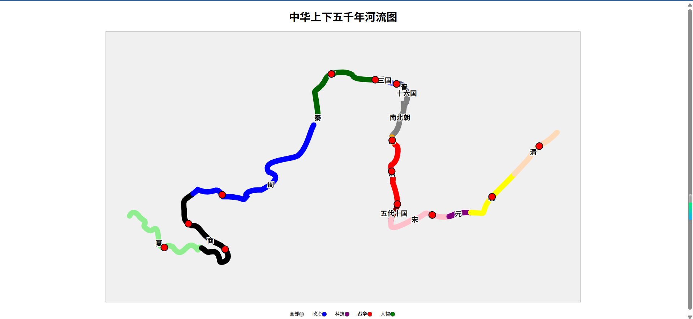

## 项目主题：
中华上下五千年河流图

## 实现工具：
- npm包管理器
- html、js、css
- D3.js库（额外需要的js库）

## 启动方法
- 首先进入项目根目录， 终端执行
```
npm install
```


- 然后在终端运行以下命令,  即可正常启动项目
```
npm start
```

## 具体实现：

- 将黄河形状本身，按朝代分别绘制为不同颜色，并标注开始、结束的节点事件及时间
- 分层展示，相应时期的人物、科技、战争等。
	- 默认展示所有节点或默认不展示任何节点
	- 点击“科技”，仅仅展示科技的历史事件的节点
	- 点击  "人物”，仅仅展示杰出历史人物的节点
	- 点击“战争”，仅仅展示重大战争的节点
 - 悬停在某段王朝时，显示相应的信息，点击节点显示相应历史事件信息。


# 实现效果：



